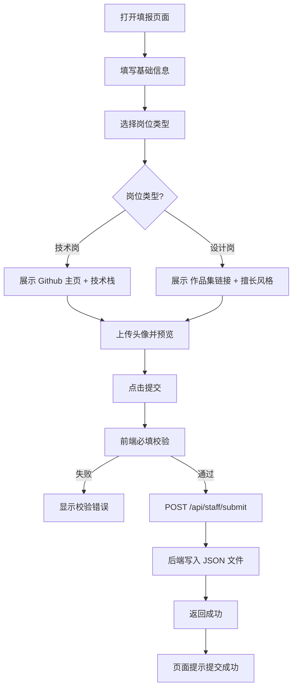

# HR 入职填报系统 - 产品需求文档 (PRD)

## 1. 产品概述

一个面向新员工的入职信息填报系统，支持根据岗位类型动态展示不同字段的表单，并支持头像上传，提交后将数据持久化到服务端 JSON 文件中。

- 主要目的：替代纸质/邮件入职登记，让新员工自助、一次性填报结构化信息。
- 目标用户：即将入职的新员工（由 HR 分发填报链接）。
- 产品价值：减少 HR 手工录入、字段随岗位自适应、数据集中可追溯。

## 2. 核心功能

### 2.1 用户角色

| 角色 | 进入方式 | 核心权限 |
|------|----------|----------|
| 新员工 | 打开填报页面 | 填写并提交入职信息表单 |
| HR | 查看服务端 JSON 文件 | 查阅已提交的入职档案 |

### 2.2 功能模块

1. **入职填报页**：基础信息 + 岗位联动字段 + 头像上传 + 提交。

### 2.3 页面详情

| 页面名称 | 模块名称 | 功能描述 |
|-----------|-------------|----------|
| 入职填报页 | 基础信息 | 姓名、邮箱、手机号、入职日期输入 |
| 入职填报页 | 岗位选择 | 单选技术岗 / 设计岗 |
| 入职填报页 | 技术岗联动字段 | Github 主页、常用技术栈（多选） |
| 入职填报页 | 设计岗联动字段 | 作品集链接、擅长风格（多选） |
| 入职填报页 | 头像上传 | 点击按钮选择本地图片并预览 |
| 入职填报页 | 提交校验 | 必填校验 + 提交反馈（成功/失败） |

## 3. 核心流程

新员工打开页面 → 填写基础信息 → 选择岗位 → 系统动态显示该岗位对应的联动字段 → 上传头像 → 点击提交 → 前端校验 → 发送至后端 `/api/staff/submit` → 后端写入 JSON 文件 → 返回成功 → 页面提示提交成功。

## 4. 用户界面设计

### 4.1 设计风格

- 主色：靛蓝 `#4f46e5`（indigo-600）作为主操作色，辅以中性灰阶（zinc）。
- 按钮：圆角胶囊式主按钮，hover 带轻微上浮阴影；次要按钮为描边样式。
- 字体：标题使用 `Sora`，正文使用 `Inter`（通过 Google Fonts 引入）。
- 布局：单列卡片式表单，居中最大宽度 640px，卡片带柔和阴影。
- 图标：使用 lucide 图标风格（线性、统一描边）。

### 4.2 页面设计概览

| 页面名称 | 模块名称 | UI 元素 |
|-----------|-----------|---------|
| 入职填报页 | 顶部标题区 | 大标题 + 副标题，左对齐 |
| 入职填报页 | 基础信息卡片 | 表单分组，输入框带 label 和 placeholder |
| 入职填报页 | 岗位联动区 | 岗位以单选卡片切换，联动字段带过渡动画 |
| 入职填报页 | 头像上传 | 圆形头像预览 + 上传按钮，支持拖拽高亮 |
| 入职填报页 | 提交区 | 主按钮 + 提交状态 loading 与成功提示 |

### 4.3 响应式

桌面优先（最大宽 640px 居中卡片），移动端自适应：表单变为单列全宽，按钮全宽，头像上传按钮增大触控热区。

### 4.4 3D 场景

不适用（本项目为纯表单类应用，无 3D 场景）。
