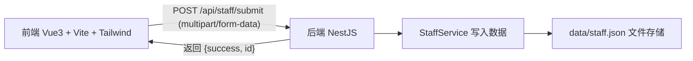
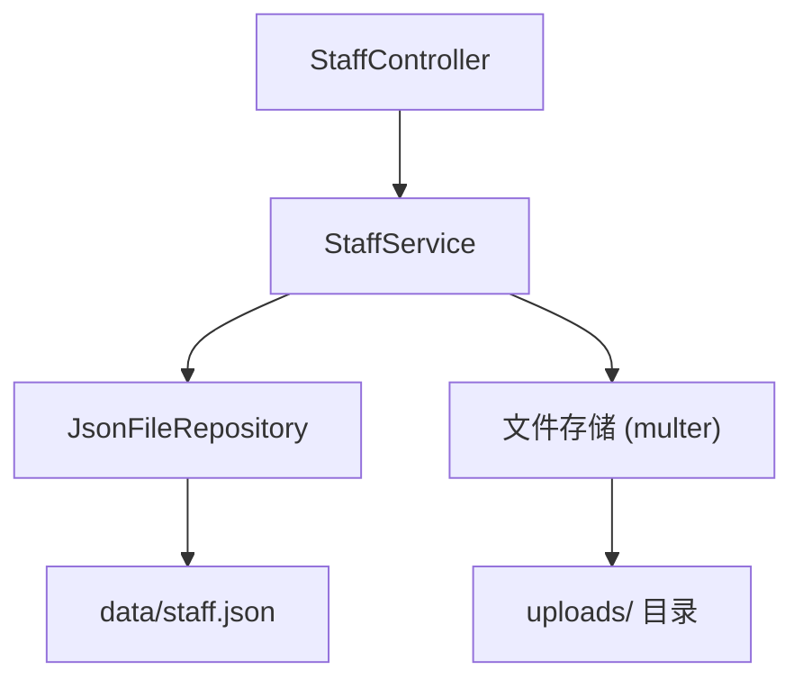
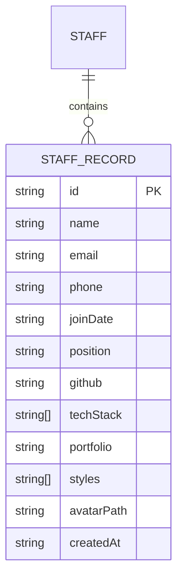

# HR 入职填报系统 - 技术架构文档

## 1. 架构设计



- 前端：Vue3（`<script setup lang="ts">`）+ Vite + Tailwind CSS，独立 dev server（默认 5173）。
- 后端：NestJS（TypeScript，ESM），独立 dev server（默认 3000），通过 Vite 代理转发 `/api`。
- 数据：以 JSON 文件持久化（`api/data/staff.json`），无外部数据库。

## 2. 技术说明

- 前端：Vue@3 + vite + tailwindcss + typescript，使用 `vue-ts` 模板初始化。
- 后端：NestJS（`@nestjs/core` 等），ESM + TypeScript，使用 `multer` 处理头像文件上传。
- 数据存储：JSON 文件（`api/data/staff.json`），头像保存到 `api/uploads/`，并在记录中存相对路径。
- 跨域：后端开启 CORS（开发环境允许 `localhost:5173`）。

## 3. 路由定义

| 路由 | 用途 |
|-------|------|
| `/` | 入职填报页面（Vue 单页） |

## 4. API 定义

### 4.1 提交入职信息

`POST /api/staff/submit`

请求：`multipart/form-data`

| 字段 | 类型 | 是否必填 | 说明 |
|------|------|----------|------|
| name | string | 是 | 姓名 |
| email | string | 是 | 邮箱 |
| phone | string | 是 | 手机号 |
| joinDate | string | 是 | 入职日期 (YYYY-MM-DD) |
| position | enum | 是 | `tech` / `design` |
| github | string | position=tech 时必填 | Github 主页 |
| techStack | string[] | position=tech 时必填 | 常用技术栈 |
| portfolio | string | position=design 时必填 | 作品集链接 |
| styles | string[] | position=design 时必填 | 擅长风格 |
| avatar | File | 否 | 头像图片文件 |

响应：

```ts
interface SubmitResponse {
  success: boolean
  id: string
  message?: string
}
```

校验规则：
- `email` 需符合邮箱格式。
- `position=tech` 时 `github` 必填、`techStack` 至少 1 项。
- `position=design` 时 `portfolio` 必填、`styles` 至少 1 项。
- `avatar` 存在时限制为图片类型、单文件。

### 4.2 TypeScript 类型定义

```ts
type Position = 'tech' | 'design'

interface StaffRecord {
  id: string
  name: string
  email: string
  phone: string
  joinDate: string
  position: Position
  github?: string
  techStack?: string[]
  portfolio?: string
  styles?: string[]
  avatarPath?: string
  createdAt: string
}

interface SubmitResponse {
  success: boolean
  id: string
  message?: string
}
```

## 5. 服务端架构图



- `StaffController`：接收 `/api/staff/submit` 请求，使用 `@UseInterceptors(FileInterceptor)` 解析头像。
- `StaffService`：执行字段校验、生成 id、组装 `StaffRecord`、调用仓储写入。
- `JsonFileRepository`：封装 JSON 文件读写（读取数组 → 追加 → 写回）。

## 6. 数据模型

### 6.1 数据模型定义



### 6.2 数据定义语言

本项目不使用关系型数据库，数据以 JSON 数组形式持久化于 `api/data/staff.json`，初始内容为空数组 `[]`。每条记录结构如下（示例）：

```json
[
  {
    "id": "1700000000000",
    "name": "张三",
    "email": "zhangsan@example.com",
    "phone": "13800000000",
    "joinDate": "2026-07-01",
    "position": "tech",
    "github": "https://github.com/zhangsan",
    "techStack": ["Vue", "Node.js"],
    "avatarPath": "/uploads/1700000000000-avatar.png",
    "createdAt": "2026-06-19T10:00:00.000Z"
  }
]
```
